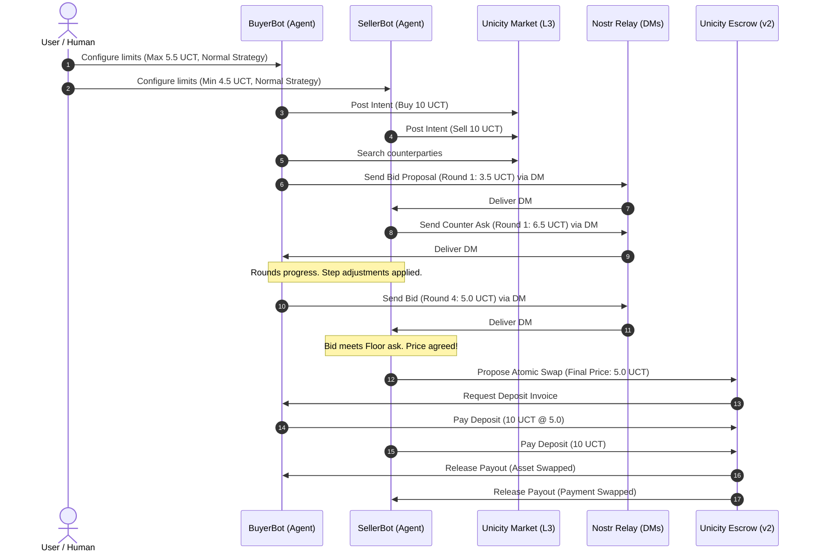

# DealBot: Autonomous P2P Negotiation & Settlement

DealBot is a complete, public-ready demonstration of autonomous P2P negotiation and atomic swap settlement on **Unicity Testnet v2** using the **Unicity Sphere SDK**.

The project showcases two autonomous economic agents—**BuyerBot** and **SellerBot**—who negotiate asset prices within user-defined bounds over Nostr direct messages, establish consensus, and execute a swap via Unicity's Escrow protocol.

---

## Target Tracks (Unicity Builder Program)
*   **Primary Track**: Autonomous Agents
*   **Secondary Track**: Payments and Markets

---

## Why is it Agentic?
Traditional decentralized commerce requires humans to sign and approve every trade step, search order books, negotiate details manually, and initiate deposits. **DealBot is fully autonomous**:
1.  **Intent Bulletin Board**: Human specifies trading boundaries *once* (max buy price, min sell price, quantity, and negotiation strategy).
2.  **Autonomous Discovery**: Bots register their signed trading intentions (`Intents`) on the `MarketModule` registry and discover compatible counterparty addresses.
3.  **Encrypted Nostr Negotiation**: Bots exchange pricing proposals round-by-round over Nostr direct messaging (DMs) using standard game-theoretic concession steps.
4.  **Trustless Settlement**: On converging to a price, they coordinate and deploy an on-chain swap contract using the `SwapModule`, depositing funds and claiming payouts trustlessly.

---

## System Architecture



---

## Sphere SDK Primitives Used
*   **Wallet Identity**: Derives secp256k1 keys and BIP39 mnemonics using `createNodeProviders` and `Sphere.init()`.
*   **Nametag & Identity Resolution**: Maps human identities (`@BuyerBot`) to `DIRECT://` ledger addresses.
*   **Market Module**: Submits signed trade vectors via `sphere.market.postIntent` and queries counterparty hooks using `sphere.market.search`.
*   **Communications Module**: Drives point-to-point encrypted DMs via `sphere.communications.sendDM` and `onDirectMessage` handlers.
*   **Swap Module (Escrow)**: Interacts with the Unicity Escrow contract engine using `proposeSwap` and `acceptSwap` for trustless L3 swap resolution.

---

## Real Testnet v2 vs. Simulation Mode

To provide a robust developer setup and pass off-chain test environments, DealBot features a **dual-mode adapter**:
*   **Testnet v2 Mode (Real)**: Instantiates the real `@unicitylabs/sphere-sdk` modules, connects to Nostr relays, and executes true ledger transactions. Requires a funded Testnet v2 wallet.
*   **Simulation Mode (Default)**: Emulates the entire protocol in-memory, including keys, DMs, intents, and transactions. Works out-of-the-box without network latency, API keys, or faucet funding.

*Toggle between these modes using the switch at the top-right of the dashboard UI, or in your `.env` file.*

---

## Getting Started

### Prerequisites
*   **Node.js**: v20 or higher (v22 recommended)
*   **NPM**: v10 or higher

### Installation
Install dependencies (including `@unicitylabs/sphere-sdk` and peer dependency `ws`):
```bash
npm install
```

### Seeding Demo Data
To immediately fill the database with realistic completed and failed negotiations:
```bash
npm run seed
```

### Run Web Dashboard
Start the Next.js dark-themed dashboard:
```bash
npm run dev
```
Open [http://localhost:3000](http://localhost:3000) to view the homepage and navigate to the dashboard.

### Run Autonomous Agents in Console
To launch the background agent runner (Node.js worker process):
```bash
npm run agents
```

### Run Automated Tests
Execute the unit and integration tests (built with Vitest):
```bash
npm run test
```

---

## AstridOS Sandboxing (Optional Bonus)

DealBot is architected to be **AstridOS-ready**. The `astrid/` directory contains:
*   [astrid/README.md](file:///d:/Gen%20ICT/astrid/README.md): Conceptual deployment guide.
*   [astrid/Capsule.toml](file:///d:/Gen%20ICT/astrid/Capsule.toml): Workspace configuration.
*   Capsule manifests for [BuyerBot](file:///d:/Gen%20ICT/astrid/buyer-bot-capsule/Capsule.toml) and [SellerBot](file:///d:/Gen%20ICT/astrid/seller-bot-capsule/Capsule.toml) declaring strict boundaries:
    *   Network access restricted to Unicity/Nostr servers.
    *   Storage access restricted to individual data subfolders.
    *   Hard financial caps (guards) preventing agent budget leaks.
